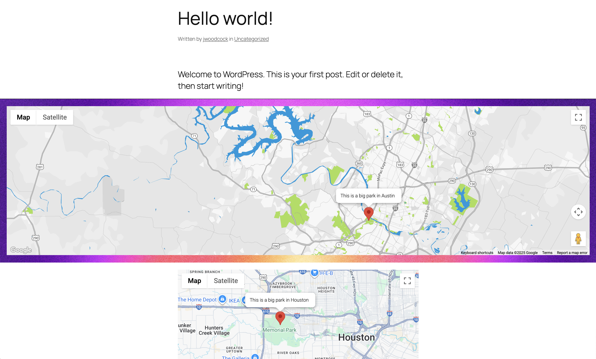

# Google Maps Block

Custom Google Maps block for Wordpress full site editing. Insert custom Google Maps block, customize the map, and set a location with information. A single page can have more than 1 map.

Allows the user to customize and set:

- Map theme (SnazzyMaps)
- Zoom level
- Map's position (via draggable Google Map)
- Show/hide map controls
- Map marker's position (draggable on the admin side)
- Map marker's label
- Block background color/image
- Block padding

Uses <a href="https://developers.google.com/maps/documentation/javascript" target="_blank">Google Maps JavaScript API</a> for front-end view and <a href="https://visgl.github.io/react-google-maps/" target="_blank">react-google-maps</a> for admin/full site editing.

## Environment Variable

Add Google Maps API key to wp-config.php

`define('GOOGLE_MAPS_API_KEY', 'google-api-key-here');`

## Development / Builds

`npm install`

`npm run start` or `npm run build`

Upload and activate in Wordpress plugins.

## Screenshots

Admin block settings:

Admin block styles:

Front-end block view:

